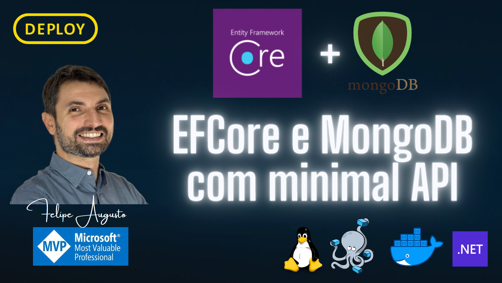

# 🚀 DEPLOY.MongoDB.EFCore-v1

Projeto criado para testar a conexão com o MongoDB utilizando o Entity Framework Core com observabilidade completa via OpenTelemetry e Jaeger.



## 📋 Índice
- [Tecnologias Utilizadas](#-tecnologias-utilizadas)
- [Arquitetura](#-arquitetura)
- [Pré-requisitos](#-pré-requisitos)
- [Configuração do Ambiente](#-configuração-do-ambiente)
- [Executando o Projeto](#-executando-o-projeto)
- [Endpoints Disponíveis](#-endpoints-disponíveis)
- [Observabilidade](#-observabilidade)
- [Manutenção](#-manutenção)
- [Referências](#-referências)

## 🛠️ Tecnologias Utilizadas

- **.NET 9** - Framework principal
- **ASP.NET Core** - API REST
- **MongoDB** - Banco de dados NoSQL
- **Entity Framework Core** - ORM para MongoDB
- **OpenTelemetry** - Observabilidade e telemetria
- **Jaeger** - Distributed tracing
- **Docker & Docker Compose** - Containerização
- **API Versioning** - Versionamento de APIs

## 🏗️ Arquitetura

### Fluxo de Dados
```
┌─────────────────┐    HTTP/OTLP    ┌──────────────────────┐    gRPC/OTLP    ┌──────────────────┐
│   .NET API      │ ──────────────► │ OpenTelemetry        │ ──────────────► │     Jaeger       │
│ (localhost:7007)│                 │ Collector            │                 │ (localhost:16686)│
└─────────────────┘                 │ (localhost:4318)     │                 └──────────────────┘
         │                          └──────────────────────┘                           │
         │                                                                             │
         ▼                                                                             ▼
┌──────────────────┐                                                         ┌─────────────────┐
│    MongoDB       │                                                         │   Traces &      │
│ (localhost:27018)│                                                         │   Metrics       │
└──────────────────┘                                                         └─────────────────┘
```

### Componentes
- **API**: Aplicação .NET com endpoints para gerenciar Boats e Marinas
- **MongoDB**: Banco de dados para persistência
- **OpenTelemetry Collector**: Coleta e processa telemetria
- **Jaeger**: Interface para visualização de traces

## 🔧 Pré-requisitos

- [.NET 9 SDK](https://dotnet.microsoft.com/download)
- [Docker](https://www.docker.com/get-started)
- [Docker Compose](https://docs.docker.com/compose/install/)

## ⚙️ Configuração do Ambiente

### 1. Variáveis de Ambiente
Configure as seguintes variáveis:

**Windows (PowerShell):**
```powershell
$env:ASPNETCORE_ENVIRONMENT="Development"
```

**Linux/macOS:**
```bash
export ASPNETCORE_ENVIRONMENT="Development"
```

### 2. Configuração do MongoDB
Configure o arquivo `docker/mongodb.env` com as credenciais:
```env
ADMIN_MONGODB_USER=admin
ADMIN_MONGODB_PASSWORD=password123
```

### 3. URLs de Acesso
- **API**: http://localhost:7007
- **API (HTTPS)**: https://localhost:7000
- **MongoDB**: localhost:27018
- **Jaeger UI**: http://localhost:16686
- **OpenTelemetry Collector gRPC**: localhost:4317
- **OpenTelemetry Collector HTTP**: localhost:4318

## 🚀 Executando o Projeto

### 1. Subir a Infraestrutura
```bash
# Subir MongoDB, OpenTelemetry Collector e Jaeger
docker compose -f docker/infra-docker.yml --env-file ./docker/mongodb.env up -d

# Verificar status dos containers
docker compose -f docker/infra-docker.yml ps
```

### 2. Executar a API
```bash
# No diretório raiz do projeto
dotnet run --project ./src/DEPLOY.MongoBDEFCore.API

# Ou com profile HTTPS
dotnet run --project ./src/DEPLOY.MongoBDEFCore.API --launch-profile "https"
```

### 3. Parar o Ambiente
```bash
# Parar e remover containers
docker compose -f docker/infra-docker.yml --env-file ./docker/mongodb.env down --volumes --remove-orphans
```

## 🔗 Endpoints Disponíveis

### Boats
- `GET /api/v1/boats/all` - Listar todos os boats
- `POST /api/v1/boats/` - Criar novo boat
- `GET /api/v1/boats/{id}` - Obter boat por ID

### Marinas
- `GET /api/v1/marinas/all` - Listar todas as marinas
- `POST /api/v1/marinas/` - Criar nova marina

### Documentação
- **OpenAPI/Swagger**: http://localhost:7007/openapi/v1.json

### Exemplos de Requisições

**Criar Boat:**
```bash
curl -X POST http://localhost:7007/api/v1/boats/ \
  -H "Content-Type: application/json" \
  -d '{"name":"Meu Barco","size":25,"license":true}'
```

**Listar Boats:**
```bash
curl http://localhost:7007/api/v1/boats/all
```

## 📊 Observabilidade

### OpenTelemetry
A aplicação está configurada com:
- **Traces**: Rastreamento de requisições HTTP
- **Metrics**: Métricas de performance da aplicação
- **Logs**: Logs estruturados

### Jaeger Tracing
1. Acesse: http://localhost:16686
2. Selecione o serviço: `canalDEPLOY.MongoBD.EFCore.API`
3. Clique em "Find Traces" para visualizar

### Métricas Disponíveis
- Duração de requisições HTTP
- Conexões ativas do Kestrel
- Performance do Entity Framework
- Métricas do MongoDB

# 🔧 Manutenção

### Atualizar Pacotes NuGet

# Instalar ferramenta (uma vez)

```powershell
dotnet tool install --global dotnet-outdated-tool
```

# Listar pacotes desatualizados
```powershell
dotnet list src/DEPLOY.MongoBDEFCore.sln package --outdated
```

# Atualizar automaticamente
```powershell
dotnet outdated src/DEPLOY.MongoBDEFCore.sln --upgrade
```

### Limpeza do Docker
```bash
# Limpeza completa (cuidado!)
docker system prune -a -f && docker volume prune -f && docker network prune -f && docker container prune -f

# Verificar uso de recursos
docker stats --no-stream
```

### Logs e Debugging
```bash
# Logs da aplicação
dotnet run --project ./src/DEPLOY.MongoBDEFCore.API --verbosity diagnostic

# Logs do OpenTelemetry Collector
docker logs opentelemetry-collector-container --tail 50

# Logs do Jaeger
docker logs jaeger-container --tail 50
```

## 📖 Referências

- [MongoDB EF Core Provider](https://devblogs.microsoft.com/dotnet/mongodb-ef-core-provider-whats-new/)
- [ASP.NET Core MongoDB Tutorial](https://learn.microsoft.com/en-us/aspnet/core/tutorials/first-mongo-app?view=aspnetcore-9.0&tabs=visual-studio)
- [Jaeger Documentation](https://www.jaegertracing.io/docs/latest/getting-started/)
- [OpenTelemetry .NET](https://opentelemetry.io/docs/languages/net/)
- [MongoDB Atlas Local](https://hub.docker.com/r/mongodb/mongodb-atlas-local)

---
🚀 **Projeto desenvolvido para demonstrar integração MongoDB + EF Core + OpenTelemetry + Jaeger**
